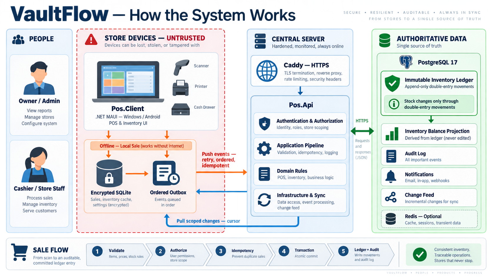
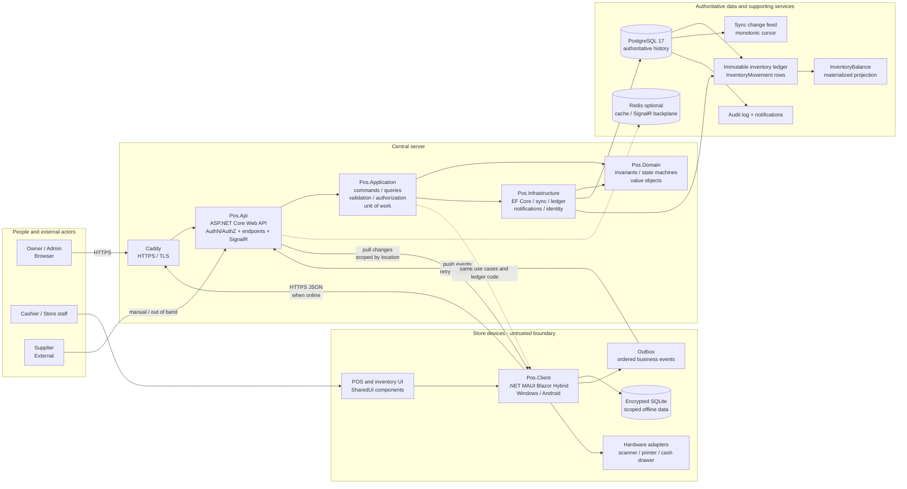
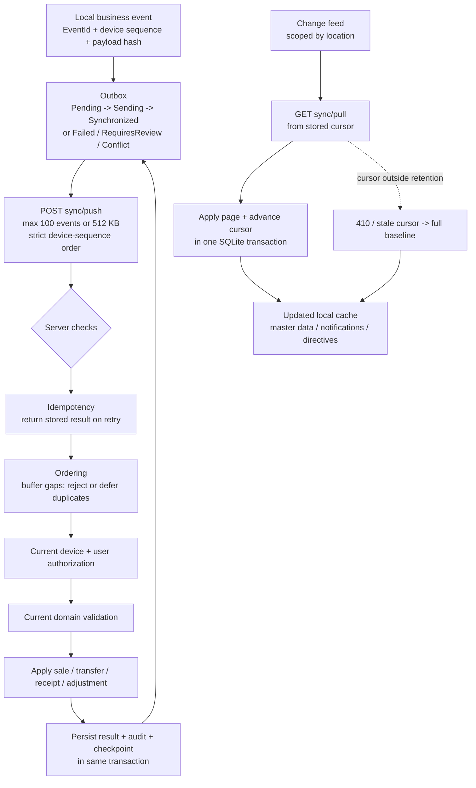
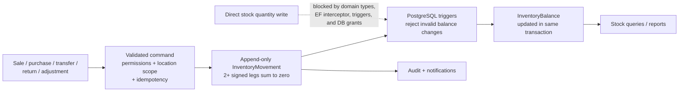

# VaultFlow System Diagram

This diagram shows the main runtime components and the two ways a business event
reaches the authoritative inventory ledger: directly while online, or through
the device outbox and synchronization pipeline while offline.



## System overview



## Online and offline sale flow

```mermaid
sequenceDiagram
    autonumber
    participant U as Cashier
    participant C as Pos.Client
    participant L as Local SQLite / Outbox
    participant A as Pos.Api
    participant P as Application pipeline
    participant D as Domain + Ledger
    participant DB as PostgreSQL

    U->>C: Create sale
    C->>P: Dispatch command
    P->>P: Correlation -> logging -> validation\n-> authorization -> idempotency -> unit of work

    alt Online
        C->>A: HTTPS command
        A->>P: Dispatch command
        P->>D: Validate and execute sale
        D->>DB: Append immutable double-entry movements\n+and sale in one transaction
        DB-->>D: Commit / result
        D-->>A: Accepted result + document number
        A-->>C: Sale result
    else Offline
        P->>D: Execute same whitelisted use case locally
        D->>L: Save sale, movement, and outbox event
        L-->>C: Immediate local result
        C-->>U: Sale complete; sync pending
        C->>A: Later: push EventId + device sequence
        A->>DB: Check idempotency and sequence
        A->>P: Re-authorize and re-validate now
        P->>D: Apply business effect if accepted
        D->>DB: Commit effect + processed event + audit\nin one transaction
        DB-->>A: Accepted / Duplicate / Rejected / Review / Conflict
        A-->>C: Original stored result
    end
```

## Synchronization loop



## Inventory integrity boundary



### Key rules represented above

- PostgreSQL is authoritative; the device is an event producer, not a table replica.
- Offline execution is limited to an explicit command whitelist and never widens authority.
- Every sync retry is safe because `EventId` and the stored payload hash provide idempotency.
- Stock changes only through immutable, double-entry inventory movements.
- `InventoryBalance` is a rebuildable projection, not an independent source of truth.
- The device clock and UI permissions are not trusted; the server re-checks authority and ordering.
